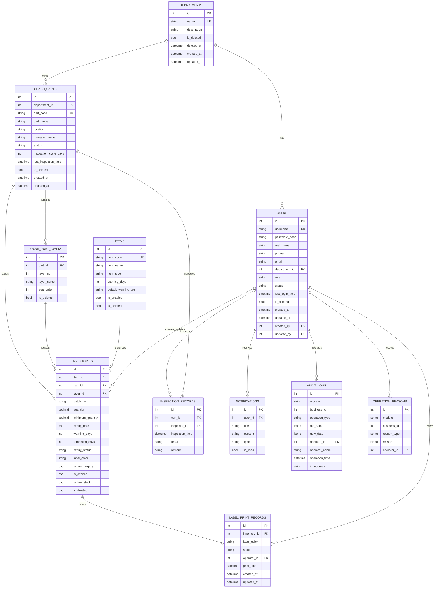

# ER 图 - 医院抢救车药品与物资效期管理系统

## 索引设计说明

| 表 | 索引 | 用途 |
|---|---|---|
| users | username, department_id, role, is_deleted | 登录、科室筛选、权限 |
| items | item_code, item_name, item_type | 主数据检索 |
| inventories | expiry_status, is_near_expiry, is_expired, is_low_stock | 效期/库存预警查询 |
| audit_logs | module, business_id, operator_id, operation_time | 审计追溯 |
| operation_reasons | module, business_id | 操作原因查询 |

## 软删除设计

以下表支持软删除（`is_deleted` + `deleted_at`）：

- departments
- users
- crash_carts
- crash_cart_layers
- items
- inventories

查询层默认过滤 `is_deleted = false`。

## 唯一约束

- users.username
- departments.name
- crash_carts.cart_code
- crash_cart_layers(cart_id, layer_no)
- items.item_code
